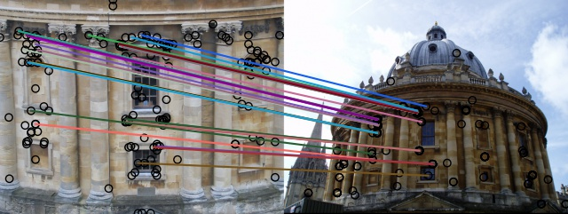

# DELG-pytorch
Pytorch Implementation of Unifying Deep Local and Global Features for Image Search ([delg-eccv20](https://arxiv.org/pdf/2001.05027.pdf))

- DELG pipline:
<p align="center"></p>

## Installation

Install Python dependencies:

```
pip install -r requirements.txt
```

Set PYTHONPATH:

```
export PYTHONPATH=`pwd`:$PYTHONPATH
```

## Training

Training a delg model:

```
python train_delg.py \
    --cfg configs/metric/resnet_delg_8gpu.yaml \
    OUT_DIR ./output \
    PORT 12001 \
    TRAIN.WEIGHTS path/to/pretrainedmodel
```

## Feature extraction

Extracting global and local feature for multi-scales
```
python tools/extractor.py --cfg configs/resnet_delg_8gpu.yaml
```
Refer [`extractor.sh`](tools/extract.sh) for using multicards

See [`visualize.ipynb`](tools/vis/attention/visualize.ipynb) for verification of local features

## Evaluation on ROxf and RPar

### Local Match

- Spatial Verification

    Install [**pydegensac**](https://github.com/ducha-aiki/pydegensac) and see **tools/rerank/spatial_verification.py**

- Examples
<p align="center"></p>

- ASMK (updating)
    
    (**https://github.com/jenicek/asmk**)

### Results 

See (https://github.com/filipradenovic/revisitop) for details

```
cd tools/revisitop
python example_evaluate_with_local.py main
```
